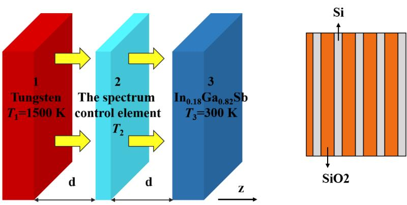

+++
title = "High-performance three-body near-field thermophotovoltaic energy conversion"
date = 2020-10-11
authors = ["Chunzhuo Dang", "Xianglei Liu", "Haifeng Xia", "__Shizheng Wen__","Qiao Xu"]
publication_types = ["2"]
abstract = ""
selected = false
publication = "Journal of Quantitative Spectroscopy & Radiative Transfer, 259, 107411, https://doi.org/10.1016/j.jqsrt.2020.107411"
publication_short = "JQSRT"

# Does this page contain LaTeX math? (true/false)
math = false

# Featured image
# To use, add an image named `featured.jpg/png` to your page's folder. 
[image]
  # Caption (optional)
  caption = "High-performance three-body near-field thermophotovoltaic energy conversion."

  # Focal point (optional)
  # Options: Smart, Center, TopLeft, Top, TopRight, Left, Right, BottomLeft, Bottom, BottomRight
  focal_point = ""
+++

**abstract**:

Three-body structures have shown great potentials in enhancing the heat transfer rate and tuning radiation spectrum in the near-field region, whereas are rarely considered in improving near-field radiative energy conversion performance. Here, a three-body thermophotovoltaic system configured by a tungsten emitter, a metallic spectrum control layer, and an In0.18Sb0.82Ga photovoltaic cell is considered. By parameter optimization of the spectrum control layer, the efficiency and output power at the gap distance of 10 nm are enhanced from 24.7% and 1.88×105 W/m2 to 35.3% and 3.62×105 W/m2, respectively. The potential mechanism lies in the excitation of coupled surface plasmon polaritons of the metallic spectrum control layer. This work paves the way for applications of three-body structure in thermophotovoltaic systems and designing high-performance energy conversion systems.

